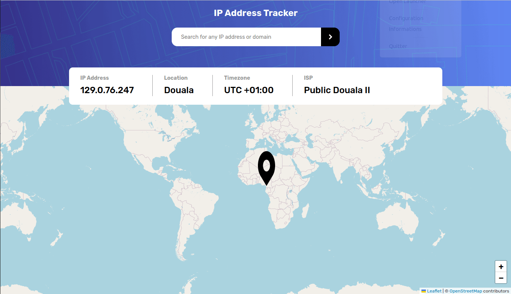

# Frontend Mentor - IP address tracker solution

This is a solution to the [IP address tracker challenge on Frontend Mentor](https://www.frontendmentor.io/challenges/ip-address-tracker-I8-0yYAH0). Frontend Mentor challenges help you improve your coding skills by building realistic projects. 

## Table of contents

- [Overview](#overview)
  - [The challenge](#the-challenge)
  - [Screenshot](#screenshot)
  - [Links](#links)
- [My process](#my-process)
  - [Built with](#built-with)
  - [What I learned](#what-i-learned)
- [Author](#author)

## Overview

### The challenge

Users should be able to:

- View the optimal layout for each page depending on their device's screen size
- See hover states for all interactive elements on the page
- See their own IP address on the map on the initial page load
- Search for any IP addresses or domains and see the key information and location

### Screenshot

### Links

- Solution URL: [https://github.com/rochelin-shikamaru/ip-address-tracker-master](https://github.com/rochelin-shikamaru/ip-address-tracker-master)
- Live Site URL: [https://iptrackers.netlify.app/](https://iptrackers.netlify.app/)

## My process

### Built with

- Semantic HTML5 markup
- CSS custom properties
- Flexbox
- SCSS
- Responsive
- JavaScript

### What I learned

this challenge allowed me to understand the use of an API and to understand API fecth and Async/Await

## Author

- Website - [Rochelin-portfolio](https://rochelin-portfolio.netlify.app/)
- Frontend Mentor - [@rochelin-shikamaru](https://www.frontendmentor.io/profile/rochelin-shikamaru)
- Twitter - [@rochelin9](https://twitter.com/rochelin9)

